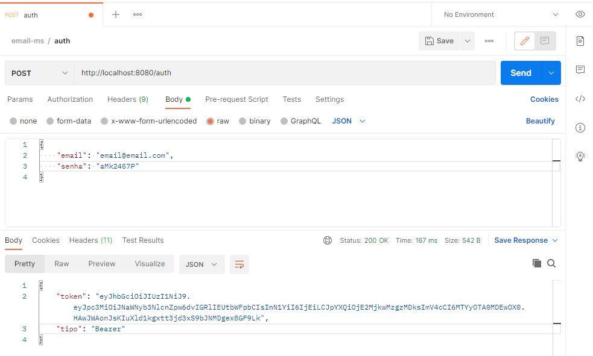
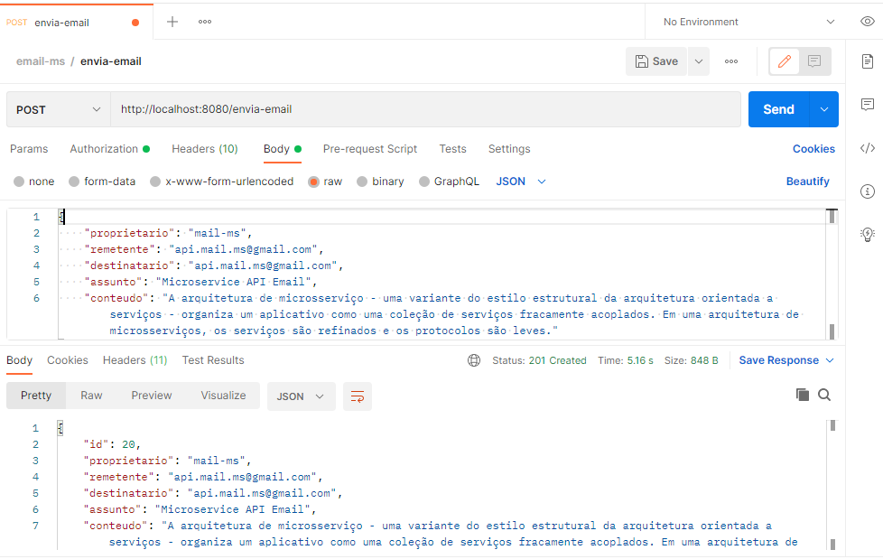
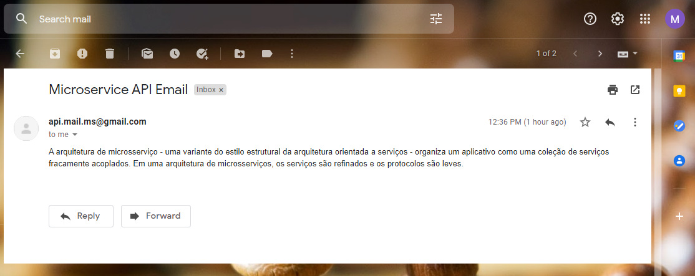
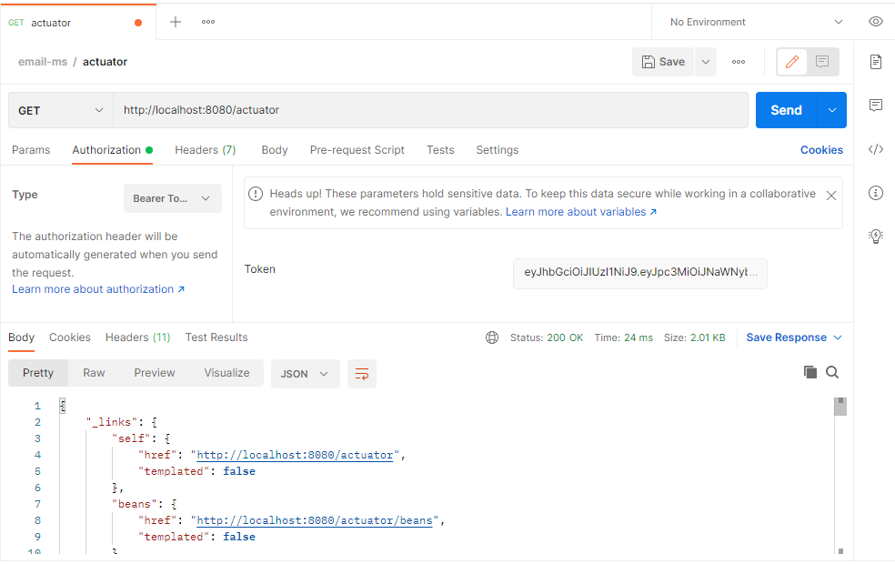
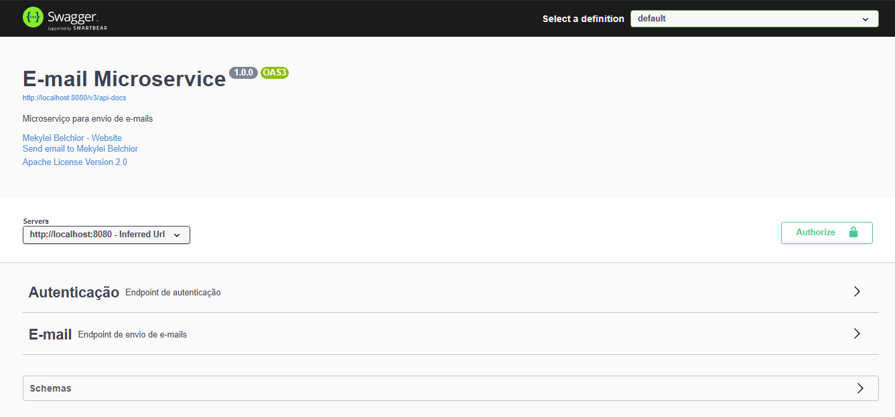

# E-MAIL MICROSERVICE

Microserviço para envio de e-mails com arquitetura REST.

## DESCRIÇÃO

Um simples microserviço desenvolvido em Java 11 utilizando Spring Boot, Spring Mail, Spring Security e MariaDB.
O serviço disponibiliza dois endpoints, um para a autenticação do cliente e o outro para o envio de email via SMTP
do Gmail. Para o monitoramento da aplicação foi utilizado o Spring Actuator e para a documentação o Springfox com o
Swagger.  

## ENDPOINTS

Para exemplo, foi utilizado o servidor Tomcat do Spring acessado via url `http://localhost:8080/` e uma conta SMTP
do Gmail.  

#### Autenticação

Os clientes da API do microserviço, com cadastro na base de dados, podem solicitar o token de autenticação via
requisição GET com um JSON das credenciais em seu body para o endpoint `auth`, conforme imagem do Postman.

#### Envio de e-mail  

Para enviar um e-mail, a API espera uma requisição com um `Bearer token` de autenticação em seu Header e um JSON com os
dados da mensagem em seu body. Para este caso, a requisição POST pode ser submetida para o endpoint `envia-email`.
Abaixo um exempolo feito no Postman:

  

  
#### Monitoramento

O monitoramento da API do microserviço é feito com o Spring Actuator ao qual pode ser integrado com o Spring Admin, por 
exemplo, para exibir as informações da aplicação via página web. O endpoint principal do Actuator é o `actuator`, ao
qual espera uma requisição GET com um `Bearer token` de autenticação em seu Header. A API devolve um JSON com todos os
endpoints que disponibilizam as informações da API.
 
 

## DOCUMENTAÇÃO

Para documentar a API do microserviço foi utilizado o Springfox com o Swagger ao qual disponibiliza uma página web com
os principais endponts da aplicação. É possível acessar a página através da url `http://localhost:8080/swagger-ui/`
e testar os dois endpoints principais.

